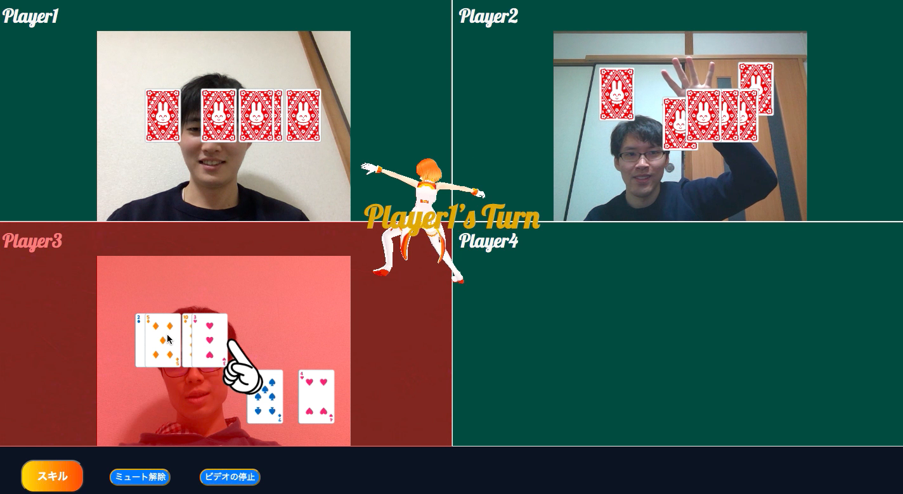
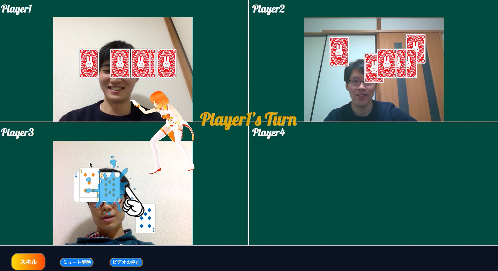

# ムードナルド・トランプ

## 製品概要
### 背景(製品開発のきっかけ、課題等）
コロナ禍において，ビデオ通話の需要が高まっている．しかし，オンラインでは，相手の感情や場の空気感を読み取るのが難しい．そこで，インタラクティブ性が高く，盛り上げ要素を加えたトランプゲームを提供することで，オンラインにおける障壁を減らし，場の空気感共有を容易にする．
### 製品説明（具体的な製品の説明）
* ビデオ通話（音声のミュートやビデオのオフも可能）
* トランプゲーム（ババ抜き）
* ジェスチャーでトランプを動かせる
* 3Dアニメーションを用いたスペシャル技でゲームを盛り上げる

### 特長
####1. ジェスチャーでトランプを動かせる
####2. 3Dアニメーションを用いたスペシャル技
####3. 場の空気感共有を容易にする

### 解決出来ること
オンラインでは，場の空気感がわかりづらい，盛りがりづらいという問題を解決する．

### 今後の展望
Webサービスとして提供できるようにホームページを作成する．
ルームIDとパスワードを入力することで，特定の部屋でゲームをできることを可能にする．
### 注力したこと（こだわり等）
* ジェスチャーでトランプを動かせる
* 3Dアニメーションを用いたスペシャル技

## 開発技術
### 活用した技術
#### API・データ
* ミライ小町の3Dデータ（バンダイナムコ研究所様提供）
* SkyWay
* Hand Pose Model

#### フレームワーク・ライブラリ・モジュール
* HTML/CSS
* JavaScript
* Node.js
* Three.js
* Redis
* TensorFlow
* WebRTC
* Socket.IO

#### デバイス
* PC(Webブラウザ)

### 独自技術
#### ハッカソンで開発した独自機能・技術
* canvasタグを複数使い，トランプが透過して見えるようにする機能を作成（/static/script.js）
* ミライ小町にモーションをつけ，複数視点のアニメーションを作成（//mmd/mmdSetting.js）
* Hand Pose Modelで手の動きを検知し，トランプをジェスチャー操作（/static/handpose.js）

