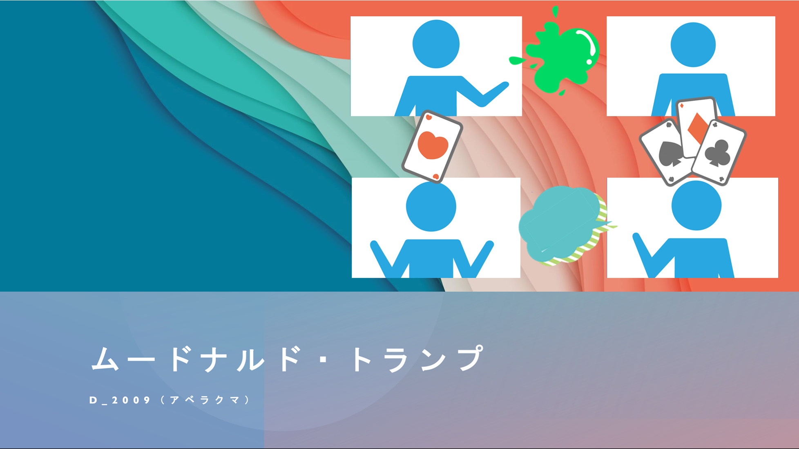

# ムードナルド・トランプ

## 製品概要
### 背景(製品開発のきっかけ、課題等）
コロナ禍において，ビデオ通話の需要が一層高まっている．しかし，オンラインでは，同じ場所にいるという一体感を得づらく，相手の感情や場の空気感を読み取るのが難しい．そこで，ビデオ通話をしながら1つの共有物であるトランプに触れることで，一体感を生み出す．さらに，インタラクティブ性が高く，盛り上げ要素を加えたトランプゲームとすることで，オンラインにおける障壁を減らす．

### 製品説明（具体的な製品の説明）
**(ビデオ通話+トランプゲーム)×場の空気感共有**
#### ビデオ通話
一般的なビデオ通話として使用することが出来ます．音声のミュートやビデオのオンオフも可能です．

#### トランプゲーム
ババ抜きができます．

#### 場の空気感共有
インタラクション性を高め，場を盛り上げる機能を実装しました．

### プロダクトの使用方法
1. https://trumpgame.herokuapp.com/?roomid=optionalId にアクセスします．ただし，`optionalId`には任意の英数字の文字列を必ず指定してください．
1. ブラウザでカメラのアクセス許可をオンにします．ブラウザをリロードすると変更が適用されます．
1. 画面下の青色のボタンで音声のミュートとビデオのオンオフが可能です．ゲームをするときは，ビデオをオンにしてください．
1. ゲームの開始するためにはスペースキーを押します．ただし，参加者が1人だとゲームは始まりません．
1. ゲーム中には，画面中央に黄色の文字でPlayerのターンが表示されます．
1. あなたのターンの時には相手の手札をクリックして選択してください．
1. 自分の手札を動かすには，マウスでドラック，またはジェスチャー（手の動き）の2つの方法があります．ジェスチャーでは，動かしたいトランプの前で手をパーからグーにし，カードを掴みます．移動したい位置にトランプを持ってきた後に，手を再度パーにすることで移動が終わります．
1. 今回のプロダクトにおける独自機能として，スキルを1ゲームに1回，任意のタイミングで使うことが出来ます．画面左下のスキルボタンを押し，スキルの効果を発動したい相手の手札をクリックしてください．
1. ゲームの勝敗が決まるとビデオ画面の上に順位が表示されます．現在の仕様として，ゲームが終わるタイミングで，ルームから退出となり，再入室の処理が行われます．

### 特長
#### 1. ビデオ通話×トランプ
今までは，ビデオ通話とゲームは別々のプラットフォームで行うのが一般的でした．
本サービスでは，ビデオ通話とゲームを1画面に集約しています．これにより，ビデオ通話とゲームのプラットフォームを行き来する必要がなくなります．さらに，インタラクション性があり，物の共有が出来るババ抜きをゲームとして採用し，その特性を最大限高める工夫を盛り込むことで，場の空気感共有を支援します．

#### 2. 自由度の高い操作
オンラインのトランプゲームでは，オフラインに比べてカードの並び替えが自由に行えないといった制約があります．本サービスでは，カードが自分のビデオ映像上であれば，どこでも自由に動かせます．また，自分の手番に関わらずいつでもカードを動かすことができるため，オンラインコミュニケーションに欠落しがちな主体性を生み出します．

#### 3. ジェスチャーでトランプを動かせる
TensorFlowで提供されている[Hand Pose Model](https://github.com/tensorflow/tfjs-models/tree/master/handpose)を使用し，手の関節の位置を検出します．検出結果をもとに，関節の角度を求め，手のジェスチャー判別します．動かしたいトランプの前で手をパーからグーにすることで，カードを掴みます．そして，移動したい位置にトランプを持ってきた後に，手を再度パーにすることで移動が完了になります．

#### 4. 3Dアニメーションを用いたスペシャル技
スキルボタンを押し，スキルの効果を発動したい相手の手札をクリックすると，3Dのミライ小町さんが登場し，その相手に向けて野球選手のようなフォームでインクを投げてきます．インクがかかった部分の手札は，15秒間相手全員から透けて見えてしまいます．スキルは1ゲームに1回使用できます．

##### スキル発動時

##### スキル発動後

### 解決出来ること
* オンラインにおける場の空気感共有
* オンラインにおける盛り上がりの欠落
* オンラインにおける一体感の欠落

### 今後の展望
* ルームIDとパスワードを入力することで，特定の部屋でゲームができることを可能にする
* Webサービスとして提供できるように，ホームページを作成する
* 他のゲームの実装

### 注力したこと（こだわり等）
* トランプをいつでもどこでも自由に動かせます
* ジェスチャーでトランプを動かせる
* 3Dアニメーションを用いたスペシャル技
* ビデオ通話をしている相手とトランプゲームが可能

## 開発技術
### 活用した技術
#### API・データ
* [ミライ小町のMMDデータ（バンダイナムコ研究所様提供）](https://www.miraikomachi.com/download/)
* [SkyWay](https://webrtc.ecl.ntt.com/documents/javascript-sdk.html)
* [Hand Pose Model](https://github.com/tensorflow/tfjs-models/tree/master/handpose)

#### フレームワーク・ライブラリ・モジュール
* HTML/CSS
* JavaScript
* Node.js
* Three.js
* Redis
* TensorFlow
* WebRTC
* Socket.IO

#### デバイス
* PC(Webブラウザ)

### 独自技術
#### ハッカソンで開発した独自機能・技術
* canvasタグを複数使い，トランプが透過して見えるようにする機能を作成 （[/static/script.js](https://github.com/jphacks/D_2009/blob/master/static/script.js)）
* ミライ小町にモーションをつけ，Three.jsを用いて複数視点のアニメーションを作成 （[/mmd/mmdSetting.js](https://github.com/jphacks/D_2009/blob/master/mmd/mmdSetting.js)）
* Hand Pose Modelで手の関節の位置を検知し，トランプをジェスチャー操作 （[/static/handpose.js](https://github.com/jphacks/D_2009/blob/master/static/handpose.js)）

### デモ動画

